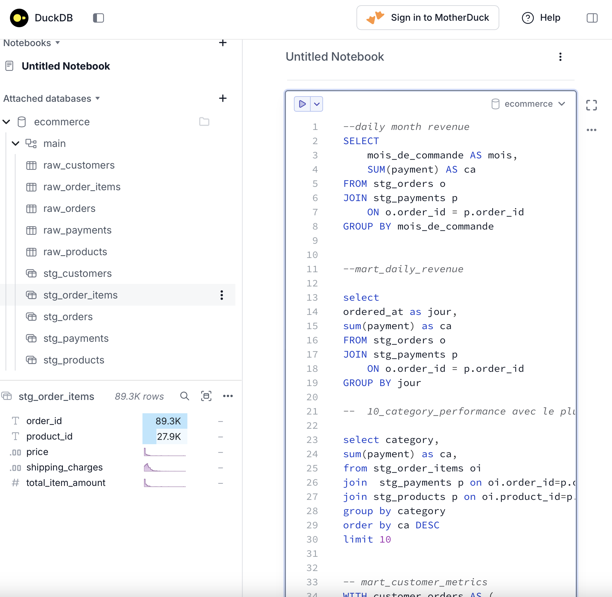

### Welcome !

This project is based on a real e-commerce dataset structured around a typical online store business model.

It includes key tables such as orders, order items, payments, customers, and products to simulate a real transactional system.

The goal of this project is to build a complete Analytics Engineering pipeline to transform raw transactional data into structured and meaningful business insights.

Using dbt for data modeling, DuckDB for storage, dbt for transformations and Power BI for visualization, the project focuses on understanding customer behavior, sales performance, and product trends.

###  Goals of this project 
- Load raw e-commerce data
- Clean and transform data with dbt
- Build analytics-ready data marts with DBT
- See my transformations on Duck DB
- Visualize key KPIs in Power BI

## Tech Stack
- DuckDB
- dbt
- SQL
- Power BI

To update my Azure skills, i use Azure  to create a Virtual Machine on which I installed PowerBI for visualition

## Project Structure
- `models/staging/` : cleaned staging models
- `models/intermediate/` : intermediate transformations
- `models/marts/` : final data marts
- `tests/` : data quality tests
- `seeds/` : static files if needed

## How to Run
```bash
dbt debug
dbt run
dbt test

My DuckDB dashboard after ETL:


